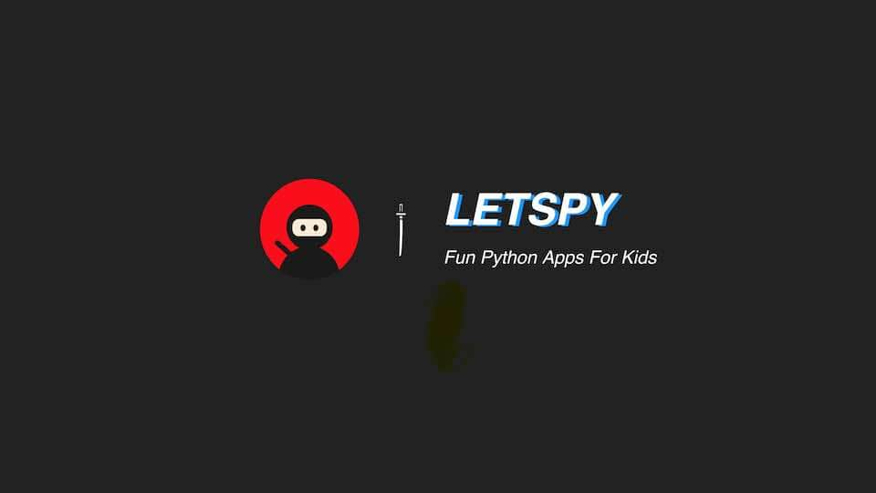

# Intro

letspy.today website source code based on [tailwind blog](https://github.com/timlrx/tailwind-nextjs-starter-blog)

### Python application source code

is [HERE](https://github.com/lwz7512/pytraining4yue)

### Features

- Daynamic Hero Image with placeholder
- Slide Component in .mdx file
- and more...